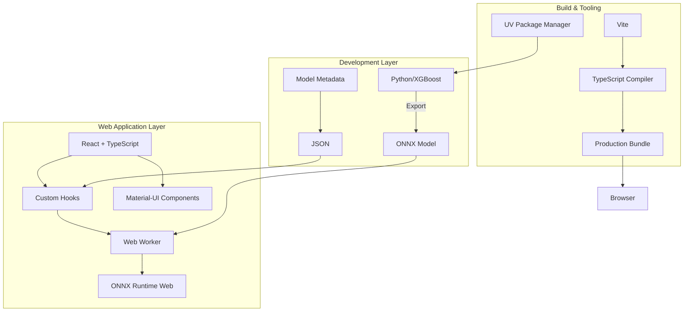
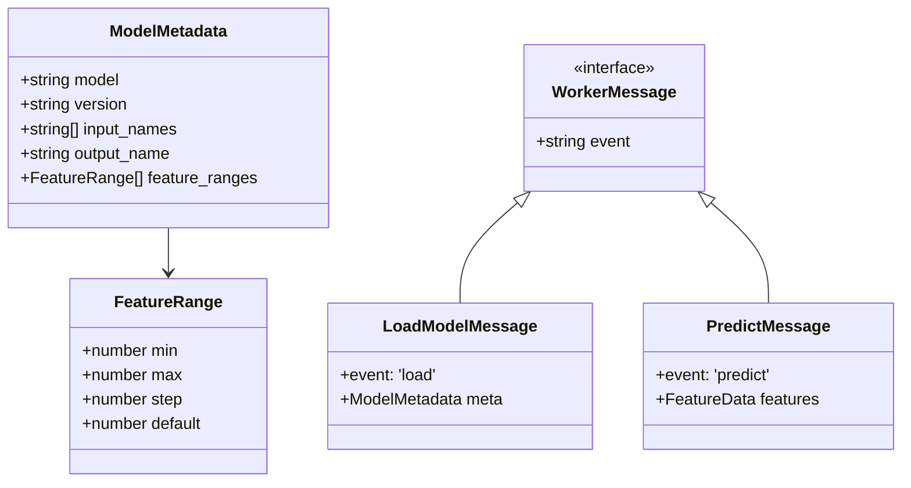
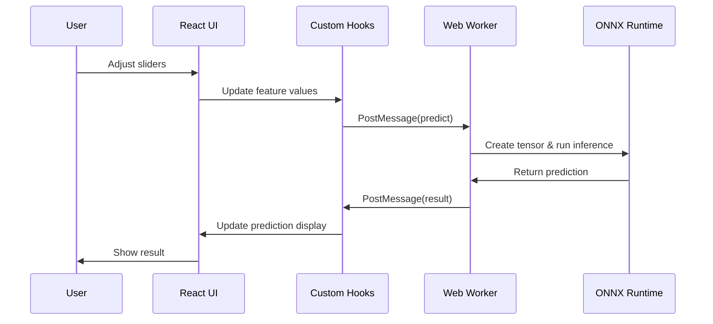
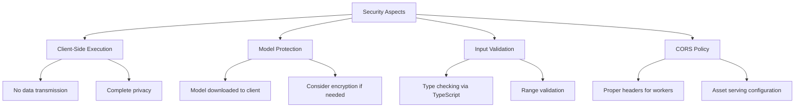
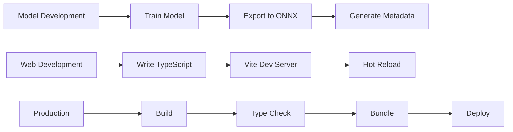

# Technical Stack Documentation: Browser-Based Machine Learning

## Executive Summary

This document provides a comprehensive overview of the technology stack used in the browser-based machine learning demo project. The project demonstrates running XGBoost models entirely in the browser using modern web technologies, achieving real-time inference without server-side processing.

## Architecture Overview



## Technology Stack Components

### 1. Machine Learning Layer

#### Python Ecosystem
- **Python 3.x**: Core programming language for ML development
- **XGBoost**: Gradient boosting framework for model training
- **scikit-learn**: Data preprocessing and model evaluation
- **skl2onnx**: Converts scikit-learn/XGBoost models to ONNX format
- **ONNX**: Open Neural Network Exchange format for model portability
- **UV**: Modern Python package manager for dependency management

```
┌─────────────────┐
│  Training Data  │
└────────┬────────┘
         │
    ┌────▼────┐
    │ XGBoost │
    └────┬────┘
         │
   ┌─────▼─────┐
   │ skl2onnx  │
   └─────┬─────┘
         │
   ┌─────▼─────┐
   │ONNX Model │
   └───────────┘
```

### 2. Frontend Framework

#### React with TypeScript
- **React 17**: Component-based UI library
- **TypeScript 5.8**: Adds static typing to JavaScript
- **React Hooks**: State management and side effects
  - Custom hooks for model loading
  - Custom hooks for predictions
  - Built-in hooks (useState, useEffect, useRef)

#### Type Safety Architecture



### 3. UI Component Library

#### Material-UI (MUI)
- **@mui/material**: React components following Material Design
- **Components Used**:
  - Container: Layout wrapper
  - Paper: Elevated surface
  - Typography: Text styling
  - Slider: Interactive feature inputs
  - Grid: Responsive layout
  - CircularProgress: Loading indicators
  - Alert: Error messages

### 4. Browser Runtime

#### ONNX Runtime Web
- **onnxruntime-web**: JavaScript library for ONNX model inference
- **WebAssembly Backend**: High-performance execution
- **Execution Providers**: 
  - WASM (WebAssembly) - default
  - WebGL (experimental)
  - WebGPU (future)

#### Web Workers
- **Purpose**: Run inference in background thread
- **Benefits**:
  - Non-blocking UI
  - Isolated execution context
  - Improved performance

```
┌─────────────┐     Messages      ┌──────────────┐
│ Main Thread │ ◄─────────────────► │ Worker Thread│
│   (React)   │                     │ (ONNX Runtime)│
└─────────────┘                     └──────────────┘
```

### 5. Build Tools

#### Vite
- **Purpose**: Fast build tool and development server
- **Features**:
  - Hot Module Replacement (HMR)
  - ES modules support
  - Optimized production builds
  - Worker compilation
- **Configuration**:
  ```javascript
  {
    plugins: [react()],
    optimizeDeps: { exclude: ['onnxruntime-web'] },
    worker: { format: 'es' }
  }
  ```

#### TypeScript Compiler
- **Target**: ES2020
- **Module System**: ESNext
- **Strict Mode**: Enabled for maximum type safety
- **JSX**: react-jsx transform

### 6. Development Dependencies

```mermaid
graph LR
    A[Package Managers] --> B[npm]
    A --> C[UV/pip]
    
    D[Type Definitions] --> E[@types/react]
    D --> F[@types/react-dom]
    
    G[Build Tools] --> H[Vite]
    G --> I[TypeScript]
    G --> J[@vitejs/plugin-react]
    
    K[Linting] --> L[ESLint]
    K --> M[TypeScript ESLint]
```

## Data Flow Architecture



## Technology Benefits Matrix

| Technology | Primary Benefit | Secondary Benefits |
|------------|----------------|-------------------|
| ONNX | Model portability | Framework agnostic, optimized inference |
| TypeScript | Type safety | Better IDE support, self-documenting |
| React | Component reusability | Large ecosystem, virtual DOM |
| Web Workers | Non-blocking UI | Parallel processing, isolation |
| Vite | Fast development | Optimized builds, HMR |
| Material-UI | Professional UI | Accessibility, responsive design |
| ONNX Runtime Web | Browser inference | WebAssembly performance, no server needed |

## Performance Characteristics

```
┌─────────────────────────────────────────┐
│         Performance Metrics             │
├─────────────────────────────────────────┤
│ Model Size: ~47KB                       │
│ Load Time: <1s (cached)                 │
│ Inference Time: <10ms                   │
│ Memory Usage: ~50MB                     │
│ Browser Support: 95%+                   │
└─────────────────────────────────────────┘
```

## Security Considerations



## Browser Compatibility Matrix

| Feature | Chrome | Firefox | Safari | Edge |
|---------|--------|---------|--------|------|
| WebAssembly | ✅ 57+ | ✅ 52+ | ✅ 11+ | ✅ 16+ |
| Web Workers | ✅ 4+ | ✅ 3.5+ | ✅ 4+ | ✅ 12+ |
| ES Modules | ✅ 61+ | ✅ 60+ | ✅ 11+ | ✅ 79+ |
| ONNX Runtime | ✅ 90+ | ✅ 89+ | ✅ 15+ | ✅ 90+ |

## Development Workflow



## Future Technology Considerations

### Potential Enhancements
1. **WebGPU Support**: For GPU-accelerated inference
2. **Service Workers**: For offline caching
3. **Progressive Web App**: Installable application
4. **Model Quantization**: Reduce model size further
5. **TensorFlow.js**: Alternative inference engine

### Emerging Standards
- **WebNN API**: Native browser ML acceleration
- **WASI**: WebAssembly System Interface
- **Web Codecs**: For multimedia ML applications

## Conclusion

This technology stack represents a modern, performant, and type-safe approach to browser-based machine learning. The combination of ONNX for model portability, TypeScript for development safety, React for UI components, and Web Workers for performance creates a robust foundation for client-side ML applications.